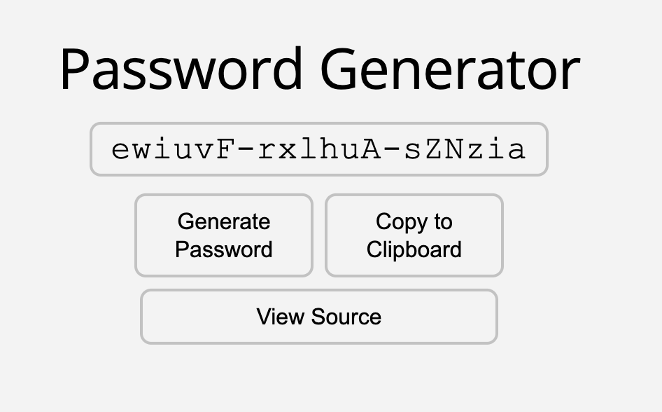

# Password Generator

Generate your own password [here!](https://piano-miles.github.io/password-generator/)

## What is this?

This is a simple, handy random password generator.
This program generates passwords that:

- contains at least one number, upper-case character, or "special" character,
- is 18 characters long with each chunk of 6 characters separated by dashes, and
- attempts to be somewhat pronounceable and memorable.

---

